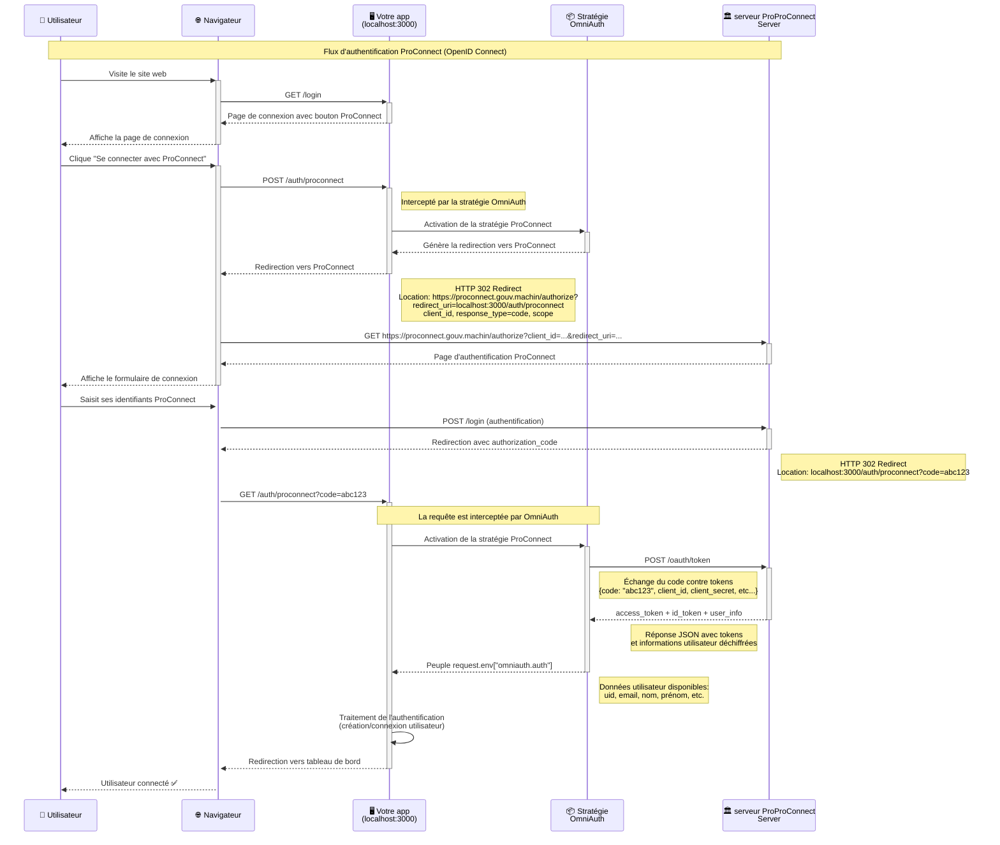

# Intégration complète de ProConnect dans votre application

Ce manuel vous guidera dans l'installation et l'utilisation de ProConnect (PC)
dans votre application avec cette librairie qui fournit une stratégie OmniAuth
adaptée.

## Brève introduction à OIDC

Le flux OpenID Connect (OIDC) se résume à :

1. Redirection : L'utilisateur est redirigé vers le serveur d'authentification
   (ProConnect)
2. Authentification : L'utilisateur s'authentifie et revient avec un code
   d'autorisation
3. Échange : Votre serveur échange ce code contre un token d'accès et les
   informations utilisateur.

D'autres cinématiques sont possibles mais c'est celle là (3-legged) qui nous
intéresse dans le schéma typique d'une application web.

## Description du flot OIDC ProConnect avec OmniAuth

En combinant avec une stratégie `OmniAuth`, voici la cinématique de connexion :

1. votre utilisateur veut se connecter et choisi le bouton ProConnect
2. le bouton ProConnect `POST` sur `localhost:3000/auth/proconnect`
3. cette URL (`/auth/proconnect`) est intercepté par le middleware OmniAuth qui
   délègue à la stratégie enregistrée pour `proconnect` (et donc :
   `omniauth-proconnect`)
4. la stratégie génère et redirige vers une URL pour aller sur ProConnect **et
   aussi** où revenir (`302 Location:
http://proconnect.fr/machin?redirect_uri=localhost:3000/auth/proconnect/callback`)
5. l'utilisateur est redirigé vers et s'authentifie sur ProConnect
6. ProConnect émet alors une redirection en utilisant la `redirect_uri` du 4) et
   rajoute un code dans les paramètres (`?code=machin`)
7. l'URL de retour
   (`http://localhost:3000/auth/proconnect/callback?code=machin`) est elle aussi
   interceptée par `OmniAuth` et la stratégie ProConnect
8. la stratégie prend le code (`?code=machin`), et l'échange de serveur (vous) à
   serveur (ProConnect) pour un jeton et des informations (email, uid, etc)
9. la stratégie peuple `request.env["omniauth.auth"]` avec ces informations puis
   rend la main
10. votre application continue et termine en invoquant l'action configurée pour
    `/auth/proconnect/callback`, enrichie grâce aux étapes 8 & 9.
11. à vous de jouer

NOTE : les endpoints d'initiation/redirection sont configurables mais les
valeurs par défaut sont parfaitement valables.



## Installation et configuration étape par étape

### Création d'une application (FS) sur ProConnect

Accédez à [l'espace partenaires de
ProConnect](https://partenaires.proconnect.gouv.fr/) et créez une
application. Stockez vos identifiants (`client_id`, `client_secret`) quelque
part (`Rails.credentials`, variables d'environnement, etc).

### Gemfile

Installez les gems requises :

```diff
+gem "omniauth"
+gem "omniauth-rails_csrf_protection"
+gem "omniauth-proconnect"
```

### Routes

Comme vu au début de ce guide, vous avez besoin de trois routes :

- une route pour présenter les options de connexion (`/login`)
- une route d'initiation du flot, celle qui calcule l'URL pour rediriger vers
  ProConnect : cette route est automatiquement écoutée par le middleware de la
  stratégie, par défaut : `/auth/proconnect`
- une route pour accueillir le redirect de ProConnect : cette route est elle
  aussi automatiquement interceptée par le middelware de la stratégie, par
  défaut `/auth/proconnect/callback`, mais la stratégie rend la main à Rack une
  fois son travail effectué : votre serveur doit donc mapper une destination à
  cette route.

```diff
# config/routes.rb

+get "sessions/new", as: :login, to: "sessions#new" # login
+get "auth/:provider/callback", to: "sessions#create" # retour de ProConnect

# pas besoin de `post "/auth/proconnect"`, la stratégie la fournit déjà
```

Nous utilisons ici un placeholder `:provider` générique pour tirer profit de
l'architecture d'OmniAuth qui permet de brancher plusieurs fournisseurs
d'identité et de récupérer une information homogène derrière : si dans le futur
vous décidez d'intégrer autre chose (ex: FranceConnect), votre configuration ne
change pas, les stratégies s'occupent de tout et vous recevez la même
information (`email`, etc) dans `sessions#create`.

Vous avez donc désormais les trois routes nécessaires :

- `/login` ;
- `/auth/proconnect` (enregistré par la librairie) ;
- `/auth/proconnect/callback` (enregistré par la librairie, mais que vous devez
  réceptionner ensuite).

Pour gérer ces routes :

```ruby
# app/controllers/sessions_controller
class SessionsController < ApplicationController
  def new
    render :new
  end

  def create
    @user = User.from_oidc(request.env["omniauth.auth"]) # voir ci-dessous

    if @user.save
      redirect_to root_path, notice: "Connexion réussie pour #{email}"
    else
      redirect_to login_path, alert: "Impossible de connecter #{email}"
    end
  end
end
```

OmniAuth permettant d'utiliser plusieurs stratégies de manière transparente,
nous créons ici une fonction qui permet d'initialiser ou de trouver un
utilisateur selon des attributs rassemblés par les stratégies (`uid` et
`info.email`), et aussi d'éviter au controller d'en faire trop :

```ruby
# app/models/user.rb
class User
  class << self
    def from_oidc(data)
      find_or_initialize_by(uid: data.uid) do |user|
        user.email = data.info.email
      end
    end
  end
end
```

NOTE : l'attribut `uid` est l'identifiant unique dans le cadre de votre
fournisseur d'identité (ici : ProConnect), c'est avec ça que vous devez les
distinguer.

### Configuration de votre URL de retour dans ProConnect

Retournez sur [l'espace partenaires de
ProConnect](https://partenaires.proconnect.gouv.fr/) et renseignez votre URL de
retour qui s'appelle "URL de connexion" à l'écriture de ces lignes, ce qui ne
veut pas dire grand chose dans le cadre d'un flot OIDC, mais en attendant ce
sera quand même : `http://localhost:3000/auth/proconnect/callback`.

### Récupération du domaine ProConnect

Le domaine ProConnect est l'URL du serveur vers lequel se tourne votre
utilisateur et plus tard l'application. Vous pouvez retrouvez celle qui vous
correspond à votre cas d'usage sur [la page PROCONNECT_DOMAIN de la
documentation
ProConnect](https://partenaires.proconnect.gouv.fr/docs/ressources/valeur_ac_domain).

En restant dans l'optique de ce guide, nous sommes en intégration hors-RIE donc
le domaine est `fca.integ01.dev-agentconnect.fr`.

**⚠️ ATTENTION**: notez que cette URL n'est pas complète car il faut rajouter
`/api/v2` pour obtenir le vrai endpoint qui permet l'interaction. **La vraie URL
est donc `https://fca.integ01.dev-agentconnect.fr/api/v2`**.

### Configuration de la stratégie

Il faut désormais enregistrer et configurer la stratégie avec les bonnes
valeurs. Par souci de simplification elles sont directement renseignées ici mais
vous devez bien évidemment les stocker dans votre environnement, dans vos
`Rails.credentials` ou quelque part de sûr et confidentiel.

```ruby
# config/initializers/omniauth.rb
Rails.application.config.middleware.use OmniAuth::Builder do
  provider(
    :proconnect, # permet à OmniAuth d'inférer la stratégie OmniAuth::Proconnect
    {
      client_id: "foo",
      client_secret: "bar",
      proconnect_domain: "https://fca.integ01.dev-agentconnect.fr/api/v2",
      redirect_uri: "http://localhost:3000/auth/proconnect/callback",
      post_logout_redirect_uri: "", # c.f fin du guide
      scope: "" # c.f fin du guide
    }
  )
end
```

### Création de la page de login

Dans votre page de login (i.e : `app/sessions/new.html.erb`), insérez un bouton
qui déclenche la stratégie ProConnect en effectuant un `POST` sur
`/auth/proconnect`.

À terme, intégrez-le comme le veut [la documentation du bouton
ProConnect](https://partenaires.proconnect.gouv.fr/docs/fournisseur-service/bouton_proconnect),
et en attendant :

```html
<div>
  <form action="/auth/proconnect" method="post" data-turbo="false">
    <button class="proconnect-button fr-btn">
      <span class="proconnect-sr-only">S'identifier avec ProConnect</span>
    </button>
  </form>
</div>
```

Et c'est bon ! Vous devriez pouvoir effectuer un login test en utilisant [les
identifiants de test de
ProConnect](https://partenaires.proconnect.gouv.fr/docs/fournisseur-service/identifiants-fi-test).

## Autres points importants

### Informations supplémentaires (scope)

Le protocole OIDC définit le concept de `scope` qui, pour simplifier, permet de
demander plusieurs jeux d'informations sur votre utilisateur en les combinant
dans l'attribut scope avec des espaces : `scope="name email telephone
pointure_chaussure aime_coriandre_ou_pas etc"`.

Il existe des [scopes standards définis par la norme
OIDC](https://openid.net/specs/openid-connect-core-1_0.html#StandardClaims) et
[ProConnect fournit aussi des scopes
standards](https://partenaires.proconnect.gouv.fr/docs/fournisseur-service/scope-claims).

Donc si vous voulez obtenir plus que le simple email qu'on vous retourne par
défaut, par exemple le SIRET et le nom, vous pouvez configurer la stratégie pour
en lui passant une liste de scopes supportés par ProConnect (voir lien
précédent) :

```diff
Rails.application.config.middleware.use OmniAuth::Builder do
  provider(
    :proconnect,
    {
      # [...]
+      scope: "email given_name usual_name siret"
    }
  )
end
```

### Déconnexion

La déconnexion d'un utilisateur est légèrement plus complexe à travers un
fournisseur OIDC : une fois que l'utilisateur clique "Déconnexion", vous devez
aussi le déconnecter du côté de ProConnect sinon vous créez une situation
asymétrique (et pénible) où votre utilisateur est déconnecté chez vous mais pas
côté ProConnect.

Pour remédier à ça, le protocole OIDC décrit une cinématique très simple où
l'utilisateur est envoyé sur le fournisseur d'identité (ici, ProConnect) pour se
déconnecter après quoi il est renvoyé sur une URL précise côté client, la
fameuse `post_logout_redirect_uri` qui indique "l'utilisateur s'est bien
déconnecté côté FI, à vous".

Une implémentation minimale ressemblerait à ça :

```diff
--- config/initializers/omniauth.rb
+++ config/initializers/omniauth.rb
Rails.application.config.middleware.use OmniAuth::Builder do
  provider(
    :proconnect,
    {
      # [...]
+      post_logout_redirect_uri: "http://localhost:3000/auth/proconnect/logged_out"
    }
  )
end

--- config/routes.rb
+++ config/routes.rb
+delete "/logout", to: "sessions#destroy"
+get "/auth/proconnect/logged_out", to: "sessions#proconnect_logged_out"

--- app/controllers/sessions_controller.rb
+++ app/controllers/sessions_controller.rb
class SessionsController < ApplicationController
  # [...]
+  def destroy
+    redirect_to "/auth/proconnect/logout" # intercepté par la stratégie
+  end
+
+  def proconnect_logged_out
+    clear_proconnect_setup!
+  end
+
+  private
+
+  def clear_proconnect_setup!
+     session
+       .to_hash
+       .select   { |k, _| k.include?("omniauth.pc") } # préfixe de stockage de la stratégie
+       .each_key { |k| session.delete(k) }
+  end
end
```
